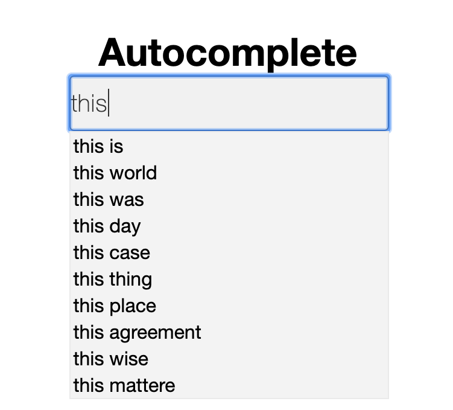

# Google Search Auto Complete

## Overview
Auto complete based on N-Gram Model using Hadoop MapReduce in Java.

## Step
* Build N-Gram library from input vis Hadoop MaRreduce.
* Build Langauge Model to calculate and sort the probability via Hadoop MapReduce.
* Output Language Model into MySQL.
* Utilized PHP, Ajax, JQuery to build a simple web demo.

## Demo

